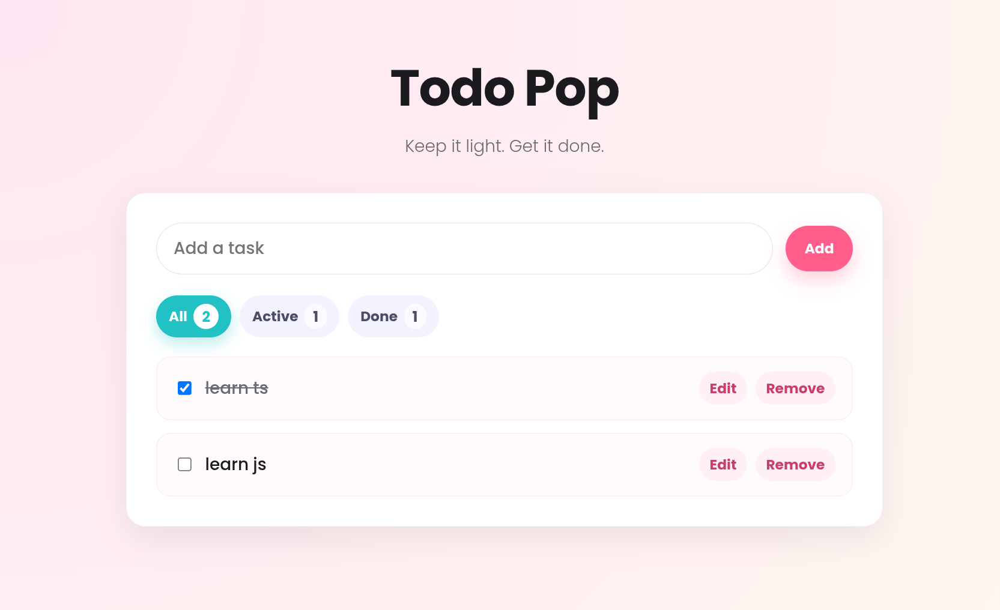
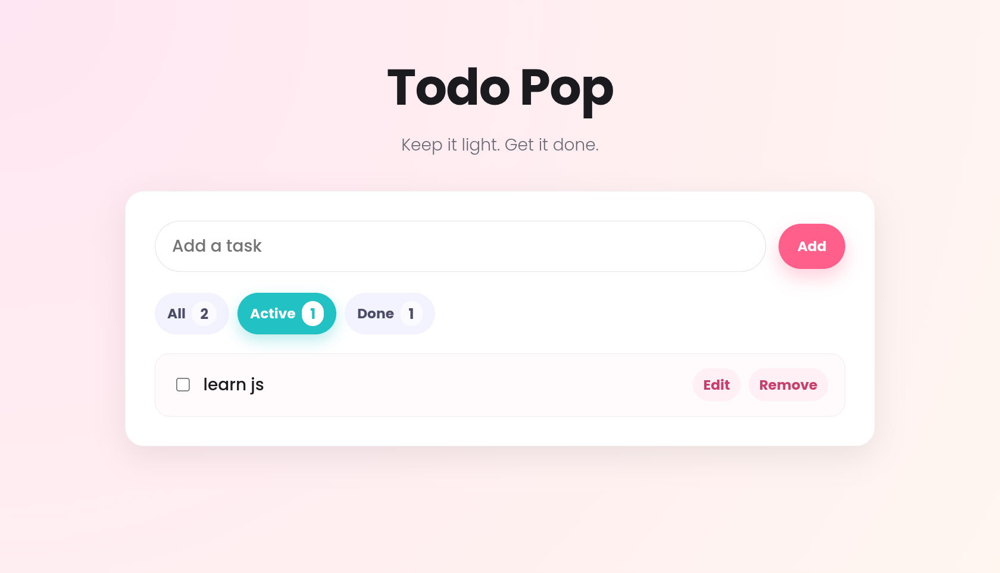
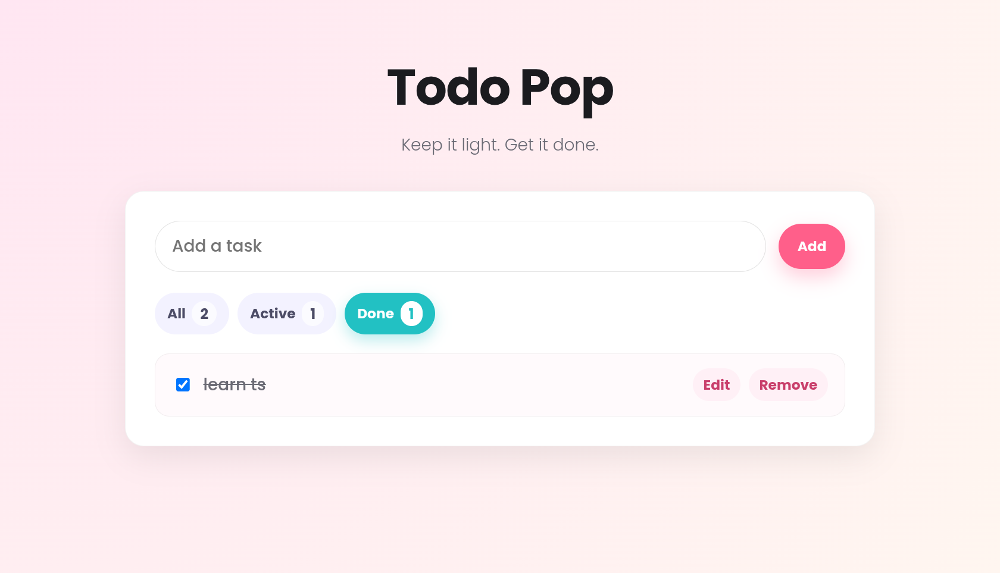

# Todo Pop

Todo Pop is a lightweight React + TypeScript todo app that now uses an **offline-first, local-first architecture**. Local edits are durable immediately, the app shell can reopen offline after an initial online load, and authenticated users can synchronize their todos across devices through Supabase.

## Preview





## Features

- Add, toggle, edit, and delete todos locally without waiting for the network
- Filters: All, Active, Completed
- Durable todo storage in IndexedDB via Dexie
- Automatic best-effort synchronization after local mutations, reconnect, app startup, and window focus
- Supabase email/password authentication
- Per-user PostgreSQL Row Level Security (RLS)
- Stable UUIDs, soft-delete tombstones, retryable sync states, and deterministic last-write-wins reconciliation
- Service Worker / PWA app-shell caching for offline reload after the app has been opened online at least once
- Legacy migration from `localStorage["todos_app_v1"]`

## Architecture

```text
Cloud/static hosting
       ↓
 Service Worker ─────── app shell available offline after prior online load
       ↓
React / TypeScript
       ↓
Dexie
       ↓
IndexedDB
       ↕
Custom Sync Engine
       ↕
Supabase
├── Auth
├── PostgreSQL
└── RLS
```

Storage responsibilities:

- **IndexedDB / Dexie** — durable local todo store and local sync metadata
- **localStorage** — legacy todo migration source and local filter preference only
- **Service Worker** — caches the built app shell; it does not synchronize todo data
- **Supabase** — authenticated cloud source of truth after successful synchronization
- **RLS** — browser authorization boundary; each authenticated user can access only their own rows
- **Cloudflare Worker / ChatGPT integration** — deliberately deferred to a future, separate privileged API phase

## Getting Started

```bash
npm install
cp .env.example .env.local
npm run dev
```

Fill `.env.local` with a Supabase project URL and browser publishable key:

```dotenv
VITE_SUPABASE_URL=https://YOUR_PROJECT_REF.supabase.co
VITE_SUPABASE_PUBLISHABLE_KEY=sb_publishable_REPLACE_ME
```

The Supabase publishable key is intentionally browser-visible. **Never put a Supabase secret key, service-role key, or other server secret in a `VITE_` variable.**

Without valid Supabase environment variables, the local todo app remains usable, but authenticated cloud synchronization is unavailable.

## Local Supabase Database

The repository contains the database migration and pgTAP security tests under `supabase/`.

```bash
npx supabase start
npx supabase db reset --local
npx supabase test db
npx supabase stop --no-backup
```

The database tests verify ownership isolation, RLS behavior, stable UUID retry behavior, and the atomic last-write-wins RPC.

## Verification

```bash
npm test
npm run lint
npm run build
```

A successful production build must generate:

```text
dist/sw.js
dist/manifest.webmanifest
```

The automated test suite includes a two-device regression that simulates independent IndexedDB databases, conflicting offline edits, convergence on the newer edit, and tombstone propagation without duplicate rows.

## Offline Behavior

Offline-first does not mean a first-ever visit can load with no network. The browser must open the deployed app online at least once so the Service Worker can cache the app shell.

After that initial online load:

1. the Service Worker can serve the app shell offline;
2. IndexedDB supplies the local todos;
3. create/edit/toggle/delete operations remain local and durable;
4. reconnecting triggers best-effort synchronization with Supabase for a valid authenticated session.

The v1 conflict strategy is deterministic last-write-wins using `updated_at`. Because timestamps originate on clients, significant device clock skew is a known v1 trade-off.

## Deployment

Build command:

```bash
npm run build
```

Output directory:

```text
dist/
```

Configure these build-time variables in the actual hosting provider:

```text
VITE_SUPABASE_URL
VITE_SUPABASE_PUBLISHABLE_KEY
```

If this project is deployed through Cloudflare Pages, set both variables for **Preview** and **Production** environments. If hosting changes, configure the equivalent build environment there instead.

### Before broad use

On the browser/device that contains any real legacy `todos_app_v1` data:

1. make a manual JSON backup of the old localStorage value when possible;
2. deploy the migration build;
3. open the app online once;
4. verify every old todo still exists with the same title and completed state;
5. verify `todos_app_v1` is removed only after successful IndexedDB migration;
6. reload and verify persistence;
7. disable networking and reload to verify the cached app shell and todos still open;
8. create/edit/toggle/delete a test todo offline;
9. reconnect and verify the status reaches **Synced**;
10. sign in on a second browser/device and verify the canonical todos arrive.

## Project Structure

```text
src/
  auth/          Supabase auth provider
  components/    Todo UI, AuthPanel, SyncStatus
  hooks/         Local app state and sync lifecycle
  state/         Reducer and selectors
  storage/       Dexie database, repository, migration, device identity
  sync/          Remote adapter, sync engine, multi-device regression
supabase/
  migrations/    PostgreSQL schema, RLS, LWW RPC
  tests/         pgTAP security and conflict tests
```

## License

MIT. See `LICENSE`.
